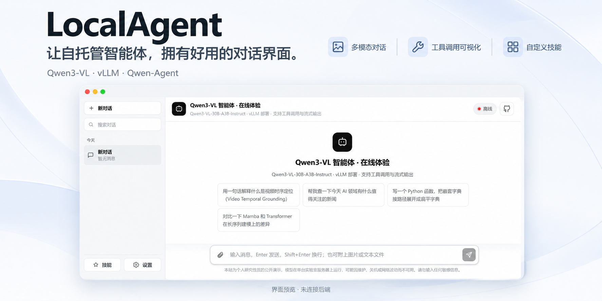
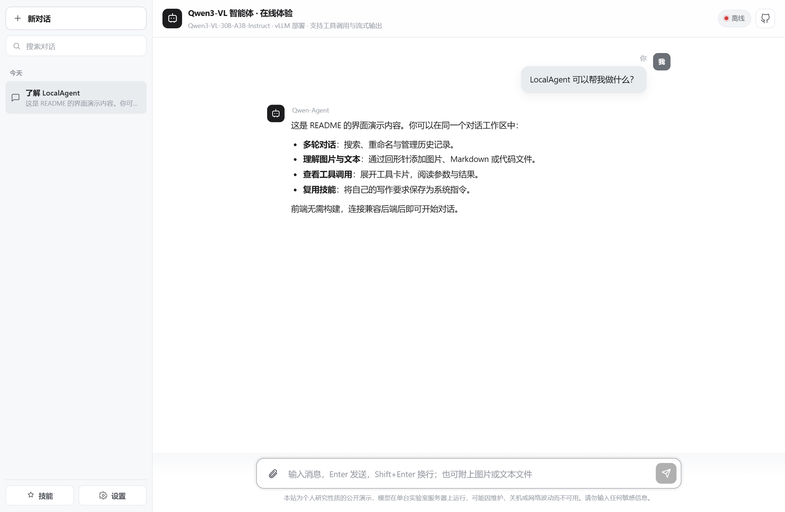
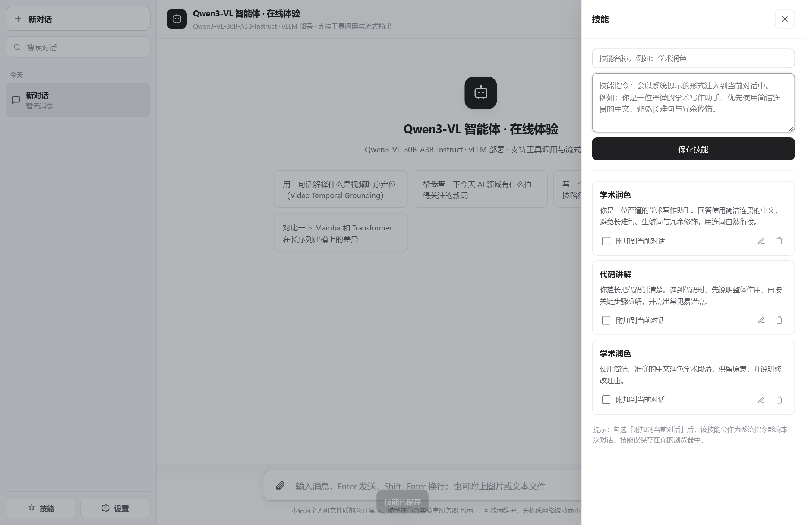
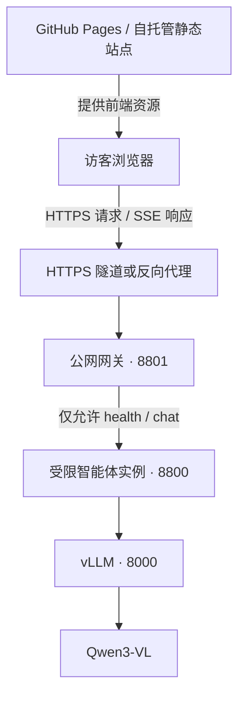

<p align="center">
  
</p>

<h1 align="center">LocalAgent</h1>

<p align="center">
  <strong>让自托管智能体，拥有好用的对话界面。</strong><br>
  基于 Qwen3-VL 与 Qwen-Agent 的公开演示前端：多模态对话、工具调用可视化、自定义技能。<br>
  原生 HTML / CSS / JavaScript，前端零第三方依赖，无需构建。
</p>

<p align="center">
  <a href="https://lhhugh.github.io/LocalAgent/"></a>
  
  
  <a href="LICENSE"></a>
</p>

<p align="center">
  <a href="https://lhhugh.github.io/LocalAgent/">在线体验</a> ·
  <a href="#界面与功能">界面与功能</a> ·
  <a href="#快速开始">快速开始</a> ·
  <a href="#部署自己的服务">部署自己的服务</a> ·
  <a href="#常见问题">常见问题</a>
</p>

---

## 这是什么

LocalAgent 把自托管的智能体接到一个轻量的浏览器对话工作区：访客打开网页即可与模型交流，上传图片或文本文件，并查看联网工具的调用过程。

仓库提供 **静态前端与 Python 公网网关**。演示后端使用 Qwen3-VL-30B-A3B-Instruct、vLLM 和 Qwen-Agent；模型权重、推理服务以及部署专用的智能体服务实现不包含在本仓库中。

> **先体验，再部署。** [打开演示站](https://lhhugh.github.io/LocalAgent/)即可查看界面。模型运行在远程服务器上，可能因维护或网络波动离线。项目名中的 Local 不表示浏览器本地推理：发送的内容会交给配置的服务端点处理。

## 界面与功能

浅色工作区将历史对话放在左侧，技能与设置位于侧栏底部，附件与消息输入集中在底部输入区；窄屏下可以通过菜单切换侧栏。

| 能力 | 你可以做什么 |
| --- | --- |
| 对话工作区 | 新建、搜索和切换对话；按时间分组查看历史，双击标题重命名，复制全文或删除，删除后 5 秒内可撤销。 |
| 图片与文本 | 通过回形针添加图片、Markdown、代码、CSV 等文本文件；发送前预览并移除附件。图片会压缩为最长边不超过 1024px 的 JPEG。 |
| 流式回复 | 随生成显示内容，支持 Markdown、代码块及复制；生成过程中可点击停止按钮中止浏览器请求。 |
| 工具过程可见 | 展开工具卡片查看调用参数和返回内容。实际可用工具由接入的智能体服务决定。 |
| 自定义技能 | 保存「名称 + 指令」，勾选「附加到当前对话」后作为系统消息随请求发送。这里的技能是提示词预设。 |
| 可配置端点 | 在侧栏底部「设置」中修改服务地址、温度和生成长度，并查看服务信息。个人配置保存在当前浏览器中。 |

<p align="center">
  
</p>

<details>
<summary><strong>展开查看：工具调用与技能面板</strong></summary>

### 工具调用


### 自定义技能



</details>

<sub>截图由当前仓库前端渲染；对话和工具结果使用明确标注的示例数据。截图未连接真实后端，离线状态不代表演示站的实时状态。顶部封面是基于该界面的设计展示图，首页原始截图见 screenshots/01-welcome.png。</sub>

## 快速开始

### 1. 本地打开前端

需要 Git 和 Python 3，无需安装 Node.js 或前端依赖。

```bash
git clone https://github.com/LHHugh/LocalAgent.git
cd LocalAgent
python -m http.server 8080 --directory docs
```

打开 **http://localhost:8080**。如果 Python 命令名为 `python3`，替换上面的 `python` 即可。

### 2. 连接服务

点击左侧底部 **设置 → 服务端点**，填写兼容服务的根地址，例如 `https://your-agent.example.com`，不要追加 `/api/chat`。留空可恢复站点默认端点；此修改只影响当前浏览器。

要更改所有访客的默认配置，编辑 [`docs/assets/config.js`](docs/assets/config.js) 中的对应字段：

```js
endpoint: "https://your-agent.example.com",
```

同一文件还可以配置站点标题、说明、示例问题、免责声明与默认生成参数。

> 前端使用 `GET /api/health` 与 `POST /api/chat`，并解析项目约定的 SSE 事件；不能仅填入任意 OpenAI `/v1` 地址就直接使用。只有前端时可以浏览界面，真实对话还需要兼容的智能体后端。

### 3. 开始一次对话

输入问题，按 **Enter** 发送、**Shift + Enter** 换行。通过回形针附加图片或文本，或者先到「技能」面板保存并启用自己的写作、解释或翻译指令。

## 工作原理



静态站点负责交付页面；聊天请求由浏览器直接发送到公网网关。网关限制访问路径、请求大小、速率与并发，并将流式响应转发给浏览器。工具能力由独立的受限智能体实例提供。

## 部署自己的服务

完整背景与操作说明见 [`server/README.md`](server/README.md)。推荐先打通后端，再发布前端。

1. **准备智能体实例。** 部署模型推理与兼容的 `/api/health`、`/api/chat` 服务；公开演示建议使用独立的受限实例，只监听本机，按需保留联网查询等工具。
2. **启动公网网关。** 在仓库根目录运行以下命令，将 `--upstream` 改成自己的智能体地址：

   ```bash
   python server/public_gateway.py --upstream http://127.0.0.1:8800 --host 127.0.0.1 --port 8801 --per-minute 6 --per-hour 40 --max-concurrent 3 --max-tokens 1024 --audit-log ./logs/audit.jsonl
   ```

3. **提供 HTTPS 入口。** 使用 ngrok、Cloudflare Tunnel 或反向代理连接网关端口。端点需要允许 CORS；本仓库网关已处理预检和 SSE 转发。
4. **发布静态页面。** 更新 `docs/assets/config.js` 的 `endpoint`。GitHub Pages 选择 **Deploy from a branch → main → /docs**；也可以将 `docs/` 部署到其他静态托管服务。

`server/start_public.sh` 是原部署环境的启停模板，使用前需修改其中的 `PY`、`ROOT` 等路径，并自行准备 `public_agent_server.py`。它不是克隆仓库后即可直接运行的完整后端安装器。

<details>
<summary><strong>可选：同步变化后的 ngrok 地址</strong></summary>

[`sync_ngrok.py`](sync_ngrok.py) 通过 SSH 读取服务器上的隧道地址并更新前端配置，额外依赖 `paramiko`。使用前配置自己的 SSH 目标；先用 `--dry-run` 查看将要修改的内容。

```bash
pip install paramiko
python sync_ngrok.py --dry-run
python sync_ngrok.py --no-push
```

脚本默认会尝试提交并推送修改；`--no-push` 用于只更新本地配置。域名是否变化取决于隧道配置，地址变化后才需要同步。

</details>

## 数据与使用边界

对话历史、技能和个人设置保存在当前浏览器的 `localStorage` 中，不提供账号同步。清理站点数据会删除这些本地记录；发送消息时，对话上下文、已启用的技能和附件内容仍会发送到所配置的后端。

公开网关默认记录访问与请求元数据，包括来源 IP、输入长度和 User-Agent。请不要向公开演示输入敏感信息。

| 当前实现 | 默认行为 |
| --- | --- |
| 公开路由 | `GET /api/health`、`POST /api/chat`；其他业务路由返回 404，另处理 CORS 预检。 |
| 限流与并发 | 每 IP 每分钟 6 次、每小时 40 次；最多 3 个并发请求，可通过启动参数调整。 |
| 请求体 | 网关上限 12 MiB；图片采用内联 data URL，网关不接受外链图片输入。 |
| 输入长度 | 前端输入框默认最多 4000 字符；文本文件读取前 30000 字符；网关再将纯文本消息或每个文本分段裁到 16000 字符。 |
| 对话上下文 | 前端发送最近 10 条有效消息，并附加启用的技能；网关保留请求中的最后 20 条消息。模型总上下文取决于实际部署。 |
| 生成长度 | 网关默认上限 1024 token。即使前端设置更高，服务端上限仍然生效。 |

网关不负责禁用上游工具；实例隔离、工具裁剪与模型部署需要由部署者完成。「前端零依赖」不包括模型服务和可选运维脚本的依赖。

## 常见问题

**页面打开了，为什么显示离线？**

静态页面可用不等于模型服务可用。检查「设置」中的端点、隧道与后端进程；域名变化后更新配置。通过 HTTPS 页面访问后端时，也应使用 HTTPS 端点。

**为什么不能上传 PDF、Word 或视频？**

当前附件入口面向图片和可读取的纯文本文件，不包含 PDF、Office 文档或视频解析器。请先转换为受支持的图片或文本格式。

**为什么回复较短，或较早的对话内容没有被记住？**

公开网关默认限制输出长度，前端只发送最近的部分历史。完整浏览器历史不会全部进入每次模型请求。

**能完全离线使用吗？**

前端资源无需外部 CDN，但真实对话仍需可访问的推理与智能体服务。只有将整套后端部署到本地，并配置不依赖外部网络的功能后，才可能离线运行。

## 项目结构

```text
LocalAgent/
├── docs/                     # 静态站点，可直接部署到 GitHub Pages
│   ├── index.html            # 页面与面板结构
│   └── assets/
│       ├── config.js         # 端点、站点文案与默认参数
│       ├── app.js            # 对话、附件、技能与 SSE 渲染
│       ├── style.css         # 桌面与窄屏样式
│       └── alipay-qrcode.png # 作者赞赏码
├── server/
│   ├── public_gateway.py     # Python 标准库公网网关
│   ├── start_public.sh       # 需适配部署环境的启停模板
│   └── README.md             # 后端部署与加固说明
├── screenshots/             # README 封面与界面截图
├── sync_ngrok.py             # 可选的域名同步工具
├── LICENSE
└── README.md
```

## 参与改进

欢迎通过 [Issues](https://github.com/LHHugh/LocalAgent/issues) 反馈问题，或提交 Pull Request。界面问题请附上浏览器、复现步骤与截图；连接问题请附上脱敏后的错误信息。修改界面后，也请同步相关截图与说明。

## 致谢与许可

感谢 [Qwen3-VL](https://github.com/QwenLM/Qwen3-VL)、[Qwen-Agent](https://github.com/QwenLM/Qwen-Agent) 与 [vLLM](https://github.com/vllm-project/vllm) 提供模型与基础能力。

本仓库代码采用 [MIT License](LICENSE)。模型权重与外部组件遵循各自的许可。

<details>
<summary><strong>支持作者</strong></summary>

如果这个项目对你有帮助，欢迎 Star，或支持作者继续维护公开演示。

<p align="center">
  
</p>

</details>
