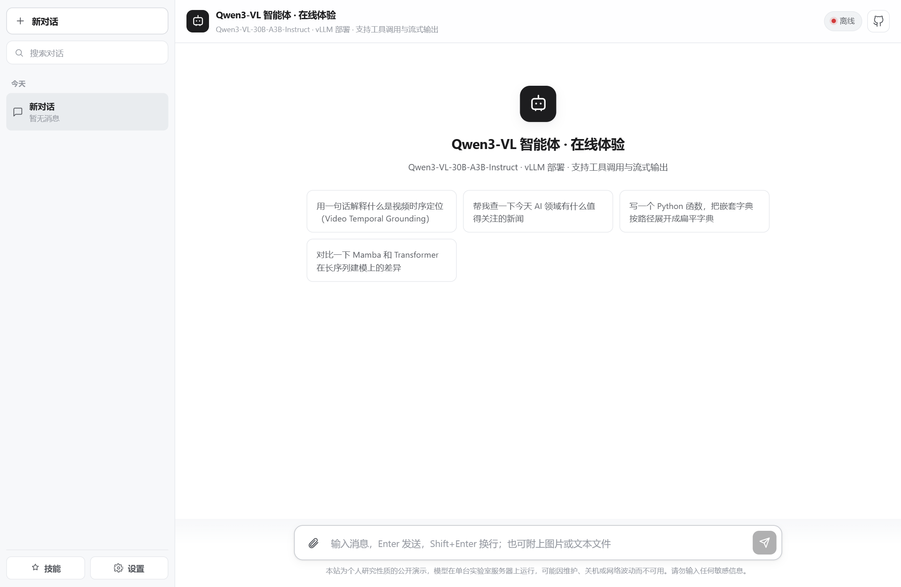
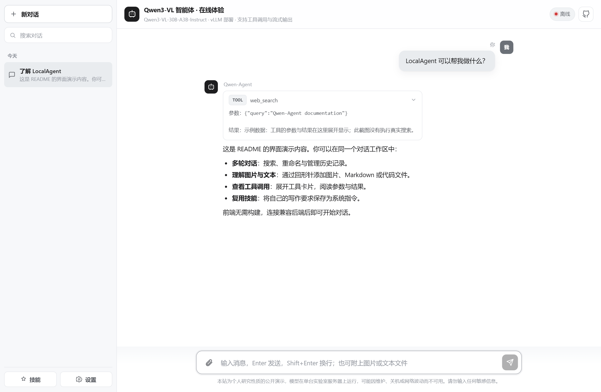

# Qwen3-VL Agent · 公开演示


把自托管的 Qwen3-VL-30B 智能体开放到公网，让任何人在浏览器里直接体验。

**在线体验：** https://lhhugh.github.io/LocalAgent/



---

## 这是什么

这是一个可公开访问的智能体聊天页面，后端运行在自托管的远程服务器上。访客打开网页就能对话，能看到模型逐字生成的流式输出，也能看到它调用联网搜索工具的全过程。

整个仓库只做三件事：一个零依赖的静态演示页面、一个把智能体安全暴露到公网的网关、一份完整的部署与加固说明。它不是一个智能体框架，也不包含模型权重；后端基于已有的 vLLM 与 Qwen-Agent 服务。

## 功能特性

演示页面刻意做成像主流 AI 网页那样顺手：

- **多轮对话与历史**：左侧边栏按「今天 / 昨天 / 近 7 天 / 更早」分组展示近期对话，支持搜索、新建、切换。
- **对话管理**：每条对话可一键复制全文、可删除（删除后 5 秒内可撤销），双击标题即可重命名。
- **单条消息复制**：鼠标悬停在某条消息上，右上角出现复制按钮，方便摘录片段。
- **技能（Skills）**：在「技能」面板里添加自定义指令（名称 + 提示词），可勾选「附加到当前对话」，作为系统提示注入本次会话；技能与对话均只保存在你的浏览器里。
- **流式输出与工具可视化**：逐字渲染，联网搜索等工具调用以可展开卡片呈现过程与结果。
- **白 / 灰主色调**：干净的浅色界面，贴近常见商业 AI 产品的观感。



---

## 为什么需要这一层设计

后端通常部署在私有网络或没有固定公网入口的服务器上，直接暴露完整智能体能力会带来较大安全风险。主智能体服务往往具备 Shell、文件读写、代码执行等工具，直接面向公网等于开放过大的攻击面。

因此，这里采用「只读实例 + 公网网关」的双层架构：由独立进程运行一个工具被裁剪过的只读实例，再由网关统一收口所有公网流量。主服务无需改动，两者通过独立的数据目录与进程隔离。

## 架构

```
访客浏览器
    │  HTTPS
    ▼
GitHub Pages ─────────────┐   静态页面，零构建
    │                     │
    │ SSE 直连（CORS 已开）│
    ▼                     │
ngrok 安全隧道 ────────────┘   公网入口，自带 HTTPS
    │
    ▼
公网网关 :8801               路由白名单 / 限流 / 并发闸门 / 请求体检
    │
    ▼
只读智能体实例 :8800         独立进程与数据目录，工具仅剩联网搜索
    │
    ▼
vLLM :8000                  Qwen3-VL-30B-A3B-Instruct-FP8，TP=2
```

页面不经过任何中转后端，直接和网关对话。之所以能这么做，是因为网关已经返回了 `Access-Control-Allow-Origin: *`，浏览器可以跨域发起 SSE 请求。少一层转发，就少一分延迟和故障点。

## 安全设计

| 层次 | 措施 |
| --- | --- |
| 实例隔离 | 独立进程、独立数据目录，工具开关文件随之隔离，与主服务互不影响 |
| 工具裁剪 | Shell、代码执行、文件读写、定时任务全部关闭，只保留 `web_search` 与 `open_url` |
| 目录白名单 | 可访问根目录清空，即使文件工具被意外打开也无处可读 |
| 路由白名单 | 公网只放行 `/api/health` 与 `/api/chat`，开关、技能、定时任务等管理接口一律 404 |
| 限流 | 按来源 IP 做每分钟与每小时双窗口限流，默认 6 次/分钟、40 次/小时 |
| 并发闸门 | 后端同时最多 3 个请求，超出的请求排队或快速失败，保护共享推理资源 |
| 请求体检 | 限制请求体大小、消息条数与单条长度，并强制把生成长度压到 1024 token 以内 |
| 脱敏 | 系统提示词去掉个人标识与目录路径，不向访客暴露后端部署细节 |
| 审计 | 每次对话写入 JSONL 日志，记录来源 IP、输入长度与 User-Agent |

网关会回显浏览器预检请求里的 `Access-Control-Request-Headers`，这样前端绕过 ngrok 免费版拦截页所需的自定义头才能通过 CORS 检查。

## 目录结构

```
LocalAgent/
├── docs/                      GitHub Pages 的站点根目录
│   ├── index.html             单页应用，无构建步骤
│   └── assets/
│       ├── config.js          端点、文案、示例问题都在这里配
│       ├── app.js             对话逻辑、SSE 解析、Markdown 渲染
│       ├── style.css          全部样式
│       └── alipay-qrcode.png  赞赏码
├── server/
│   ├── public_gateway.py      公网网关，纯标准库实现
│   ├── README.md              部署与安全加固说明
│   └── start_public.sh        一键启停脚本
├── sync_ngrok.py              域名变更时一键同步 config.js
├── screenshots/
├── LICENSE
└── README.md
```

## 本地运行

```bash
cd docs
python3 -m http.server 8000
# 打开 http://127.0.0.1:8000
```

页面打开后会自己检测端点状态。如果服务离线，顶部会给出提示，你也可以在右上角「设置」里填入自己的端点地址，这个地址只保存在本机浏览器。

要连到你自己的智能体后端，改动 `docs/assets/config.js` 里的 `endpoint` 即可。

## 部署成你自己的一套

完整步骤见 [`server/README.md`](server/README.md)，大致是四步：

1. 起一个只读的智能体实例，只监听 `127.0.0.1`
2. 在它前面挂上 `public_gateway.py`
3. 用 ngrok、frp 或 Cloudflare Tunnel 等安全隧道把网关端口暴露出去
4. 把拿到的 HTTPS 地址填进 `docs/assets/config.js`，推送后 GitHub Pages 自动生效

GitHub Pages 的源设置成 `main` 分支的 `/docs` 目录即可，不需要任何构建流程。

ngrok 免费域名每次重启都会变化，仓库里提供了 `sync_ngrok.py`，可以一键读取当前地址、改写 `config.js` 并尝试推送。

## 已知限制

- 后端服务在远程服务器上运行，关机、断网或维护期间演示页会显示离线，这属于预期行为。
- **ngrok 免费版每次重启都会换一个新地址**（已实测验证），更换后需要同步修改 `docs/assets/config.js` 里的 `endpoint` 并重新推送 Pages。想要固定地址：① ngrok Hobbyist（$10/月）可在控制台挑选一个自定义域名，用 `NGROK_DOMAIN=你的域名.ngrok.app bash server/start_public.sh` 启动；② 或改用 Cloudflare Tunnel（免费，需自备一个域名）。
- 模型上下文为 8192 token，长对话会被自动截断；生成长度也限制在 1024 token 以内，目的是让更多人能公平地用上共享推理资源。

## 许可

代码采用 [MIT](LICENSE) 协议。请注意，这个许可只覆盖本仓库的代码，不涉及后端模型权重与数据。

## 致谢

后端推理使用 [vLLM](https://github.com/vllm-project/vllm)，智能体框架使用 [Qwen-Agent](https://github.com/QwenLM/Qwen-Agent)，模型为通义千问团队开源的 Qwen3-VL-30B-A3B。

---

## 支持作者

如果你觉得这个项目有帮助，欢迎扫码支持一杯咖啡，继续维护更多类似的公开演示与工具。


